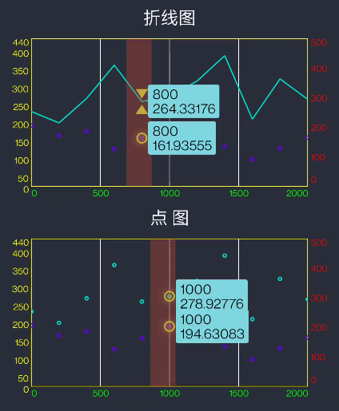

# UglyChart


# How to


To get a Git project into your build:

**Step 1.** Add the JitPack repository to your build file

```groovy
	dependencyResolutionManagement {
		repositoriesMode.set(RepositoriesMode.FAIL_ON_PROJECT_REPOS)
		repositories {
			mavenCentral()
			maven { url 'https://jitpack.io' }
		}
	}
```

**Step 2.** Add the dependency

```groovy
	dependencies {
	        implementation 'com.github.mhgd3250905:UglyChart:Tag'
	}
```


[使用说明](/README_ABOUT.md)


- [x] 平滑曲线
- [x] 数据更换动画效果
- [x]  曲线填充
- [x] 边框、网格、xy轴 颜色自定义
- [x] 自定义数据选择





- Demo1


- demo2


