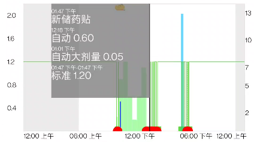
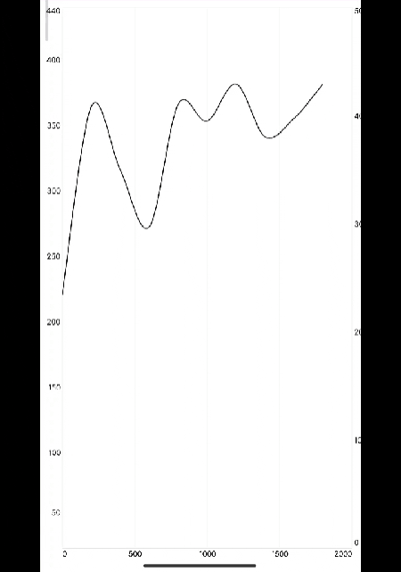
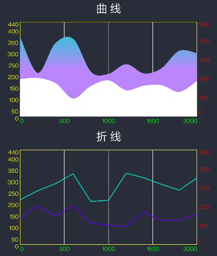
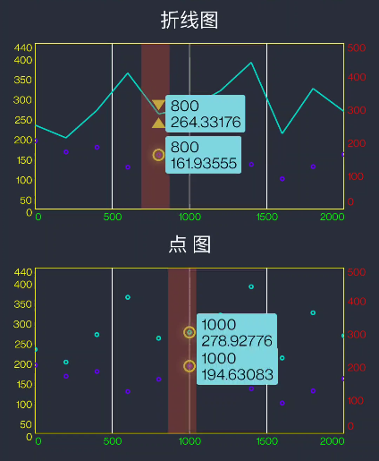
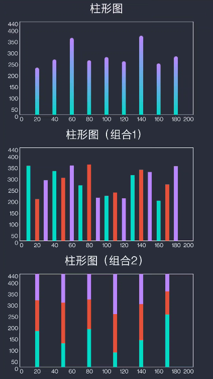
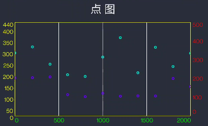
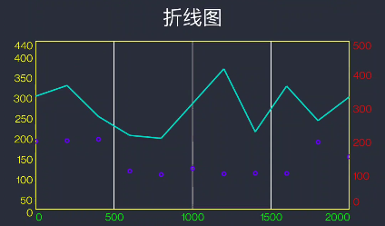
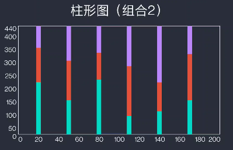
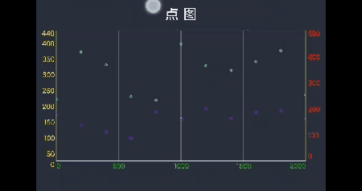

## 关于UglyChart

工作需要实现一个相对比较复杂的图表，大致如下:



大概难点：

 - 短时间或同一时间存在多种类型的事件数据，触摸选择时的显示问题
 - 增加数据渲染类型
 - 增加渲染效果
 - 各种各样的需求


>  总之被折磨了很久，所以痛定思痛决定自己写一个图表库，尽可能满足工作场景中的各种需求变化



#### 


### 第一阶段 XY轴图表

这里将具有XY轴的二维图表（折线图、柱形图、点图）都概括为XY轴图表。这类图表的核心就是传入数据类型```<X,Y>```,然后根据坐标渲染在XY轴范围内。

所以将这个模型抽象为如下几个部分：

- ```DataSet```：用来收集数据，以及绘制数据
- ```MarkerBuilder```：选中数据的展示Marker构造器
- ```HighlightBuilder```：触摸Highlight构造器


#### 1.DataSet

其核心就是实现了这个绘制接口：

```java
public interface IEntryDrafter {

    /**
     * 绘制单个数据点
     * @param canvas 画布
     * @param index 序号
     * @param p 数据坐标
     * @param viewportInfo 图表参数
     */
    void drawSingleEntry(Canvas canvas, int index, PXY p, ViewportInfo viewportInfo);

    /**
     * 绘制2个数据点
     * @param canvas
     * @param index 第一个数据序号
     * @param p1
     * @param p2
     * @param viewportInfo
     */
    void drawDoubleEntry(Canvas canvas, int index, PXY p1, PXY p2, ViewportInfo viewportInfo);

    void drawTripleEntry(Canvas canvas, int index, PXY p1, PXY p2, PXY p3, ViewportInfo viewportInfo);

    void drawQuatraEntry(Canvas canvas, int index, PXY p1, PXY p2, PXY p3, PXY p4, ViewportInfo viewportInfo);

    /**
     * 绘制数据被选中时的样式
     * @param canvas
     * @param index 数据序号
     * @param p 坐标
     * @param viewportInfo 图表信息
     */
    void drawHighlightEntry(Canvas canvas, int index, PXY p, ViewportInfo viewportInfo);

}
```

---

```drawSingleEntry```:其实很简单，也就是根据传入的数据，将计算好的数据点以屏幕坐标的方式回传回来，画布直接绘制自定义的样式，回传的数据有1颗~4颗四种类型，如果绘制点图，那么实现```drawSingleEntry```：

```java
@Override
public void drawSingleEntry(Canvas canvas,int index, PXY p, ViewportInfo viewportInfo) {
    canvas.drawCircle(p.getX(), p.getY(), radius, paint);
}
```



---

```drawDoubleEntry```:如果是折线图，那么只需要实现```drawDoubleEntry```，将相邻的两个点绘制连接线段即可：

```java
@Override
public void drawDoubleEntry(Canvas canvas,int index, PXY p1, PXY p2, ViewportInfo viewportInfo) {
    Path path=new Path();
    path.moveTo(p1.x,p1.y);
    path.lineTo(p2.x,p2.y);
    canvas.drawPath(path,paint);
}
```



---

```drawTripleEntry```：很显然这是回传3个连续数据的回调方法，根据3个一组的方式组织好数据传入，那么就可以实现如下的图表：

```java
@Override
public void drawTripleEntry(Canvas canvas, int index, PXY p1, PXY p2, PXY p3, ViewportInfo viewportInfo) {
    float y1 = p1.y;
    float y2 = p2.y;
    float y3 = p3.y;
    float total = y1 + y2 + y3;
    float height = viewportInfo.bottom - viewportInfo.top;
    float p1Height = height * y1 / total;
    float p2Height = height * y2 / total;
    float p3Height = height - p1Height - p2Height;
    float y1Bottom = viewportInfo.bottom;
    float y1Top = viewportInfo.bottom - p1Height;
    float y2Bottom = y1Top;
    float y2Top = y1Top - p2Height;
    float y3Bottom = y2Top;
    float y3Top = viewportInfo.top;
    if (index % 3 == 0) {
        Rect rect1 = new Rect((int) (p2.x - 10), (int) y1Top, (int) (p2.x + 10), (int) y1Bottom);
        drawable1.setBounds(rect1);
        drawable1.draw(canvas);
        Rect rect2 = new Rect((int) (p2.x - 10), (int) y2Top, (int) (p2.x + 10), (int) y2Bottom);
        drawable2.setBounds(rect2);
        drawable2.draw(canvas);
        Rect rect3 = new Rect((int) (p2.x - 10), (int) y3Top, (int) (p2.x + 10), (int) y3Bottom);
        drawable3.setBounds(rect3);
        drawable3.draw(canvas);
    }
}
```




#### 2.MarkerBuilder

> 数据选择显示标记，触摸滑动x轴，显示选择到的数据并显示出来

核心接口：

```java
public interface IMarkerBuilder {
    /**
     * 构建marker
     * @param entries
     * @return 返回绘制marker的高度
     */
    float builderMarker(Canvas canvas,DataType dataType, List<Entry> entries, float hightLightPx, float markerHeight, ViewportInfo viewportInfo);
}
```

和```DataSet```类似，将被选中的数据直接回调出来，然后由开发者自己进行绘制：

```java

    @Override
    public float builderMarker(Canvas canvas, DataType dataType, List<Entry> entries, float hightLightPx, float markerHeight, ViewportInfo viewportInfo) {

        switch (dataType) {
            case SinglePoint:
                bgPaint.setColor(Color.WHITE);
                break;
            case DoublePoint:
                bgPaint.setColor(Color.WHITE);
                break;
            case TriplePoint:
                break;
            case QuatraPoint:
                break;
            case CurveSingle:
                break;
            case CurveDouble:
                break;
        }
        labelWidth = 0f;
        for (int i = 0; i < entries.size(); i++) {
            labelTotalHeight = padding;
            Object data = entries.get(i).getData();
            if (data == null) continue;
            if (data instanceof String[]) {
                String[] strArr = (String[]) data;
                if (strArr.length == 0) continue;

                //step 计算最大宽度
                String maxLabel = strArr[0];
                for (String s : strArr) {
                    if (maxLabel.length() < s.length()) maxLabel = s;
                }
                labelStr = maxLabel;
                labelPaint.getTextBounds(labelStr, 0, labelStr.length(), labelRect);
                labelRectWidth = labelRect.width();
                labelRectHeight = labelRect.height();
                labelWidth = labelRectWidth;
                labelHeight = (labelRectHeight + padding) * strArr.length + padding;

                labelRect.set(
                        (int) (20f + entries.get(i).getPx()),
                        (int) (entries.get(i).getPy() - labelHeight / 2 ),
                        (int) (20f + entries.get(i).getPx() + labelWidth + 2 * padding),
                        (int) (entries.get(i).getPy() + labelHeight / 2)
                );

                markerBg.setBounds(labelRect);
                markerBg.draw(canvas);

                for (int j = 0; j < strArr.length; j++) {
                    labelStr = strArr[j];

                    canvas.drawText(labelStr,
                            20f + entries.get(i).getPx()+padding,
                            labelRect.top + labelTotalHeight + labelRectHeight,
                            labelPaint);
                    labelTotalHeight += labelRectHeight + padding;
                }

            }
        }
        return labelTotalHeight;
    }
```

滑动触摸时就会有如下的效果：



---

#### 3.HighlightBuilder

如上图显示，滑动的时候，触摸区域的绘制，实现如下接口：

```java
public interface IHighlightBuilder {
    /**
     * 绘制Highlight触摸区域
     * @param canvas 画布
     * @param px 触摸x坐标
     * @param viewportInfo 图表信息
     */
    void drawHighlight(Canvas canvas,float px,ViewportInfo viewportInfo);
}

```

那么绘制一个宽为80f的触摸区域就很好实现了：

```java
/**
 * 自定义HighLight Marker显示
 */
public class MHighlightBuilder extends HighlightBuilder {
    public MHighlightBuilder(Context context) {
        Paint paint = new Paint();
        paint.setAntiAlias(true);//设置抗锯齿
        paint.setStyle(Paint.Style.STROKE);//实心
        paint.setStrokeWidth(80f);//线条粗细
        paint.setColor(ContextCompat.getColor(context,R.color.high_light_find_color));//线条粗细

        setPaint(paint);
    }

    @Override
    public void drawHighlight(Canvas canvas, float px, ViewportInfo viewportInfo) {
        super.drawHighlight(canvas, px, viewportInfo);
    }
}
```

---

#### 4.图表设置

参照了不少MPAndroid的方法设计，注释挺详细的:

```java
    private void initChart(MChart chart) {
        //设置数据集合绘制优先级
        chart.setPriorityHelper(new MPriorityHelper());
        //设置纵横网格是否显示
        chart.setGridVisibility(true, false);
        //设置横纵坐标是否显示
        chart.setLabelVisibility(true, true);
        //设置图表label的颜色
        chart.setLabelColor(Color.GREEN,Color.YELLOW,Color.RED);
        //设置背景颜色
        chart.setBgColor(ContextCompat.getColor(LineActivity.this,R.color.chart_bg_dark));
        //设置网格颜色
        chart.setGridColor(ContextCompat.getColor(LineActivity.this,R.color.white));
        //设置边框颜色
        chart.setBorderColor(Color.YELLOW);
        //设置Marker构造器
        chart.setMarkerBuilder(new MMarkerBuilder2(LineActivity.this));
        //设置highlight寻找模式
        chart.setHightlightMode(HightlightMode.desorption);
        //设置Highlight构造器
        chart.setHighlightBuilder(new MHighlightBuilder(LineActivity.this));
        //构建X轴坐标
        BaseAxis xAxis = new BaseAxis();
        xAxis.setMin(0);
        xAxis.setMax(2000);
        xAxis.setMidCount(3);
        xAxis.setiLabelFormatter(new ILabelFormatter() {
            @Override
            public String getLabelFormat(int value, int min, int max) {
                return String.format("%d", value);
            }
        });

        chart.setxAxis(xAxis);

        //构建Y轴坐标
        BaseAxis yAxis = new BaseAxis();
        yAxis.setMin(27);
        yAxis.setMidCount(7);
        yAxis.setMax(440);
        yAxis.setLabelArrs(new int[]{0,50, 100, 150, 200, 250, 300, 350, 400, 440});

        yAxis.setiLabelFormatter(new ILabelFormatter() {
            @Override
            public String getLabelFormat(int value, int min, int max) {
                return value + "";
            }
        });

        chart.setyAxis(yAxis);

        //构建Y轴2坐标
        BaseAxis y2Axis = new BaseAxis();
        y2Axis.setMin(0);
        y2Axis.setMidCount(4);
        y2Axis.setMax(500);
//        yAxis.setLabelArrs(new int[]{50,  150, 210, 250, 300, 310, 400, 440});

        y2Axis.setiLabelFormatter(new ILabelFormatter() {
            @Override
            public String getLabelFormat(int value, int min, int max) {
                return value + "";
            }
        });

        chart.sety2Axis(y2Axis);
    }
```


**目前这个库还在继续完善中，轻喷（狗头）**


**[UglyChart](https://github.com/mhgd3250905/UglyChart)**

